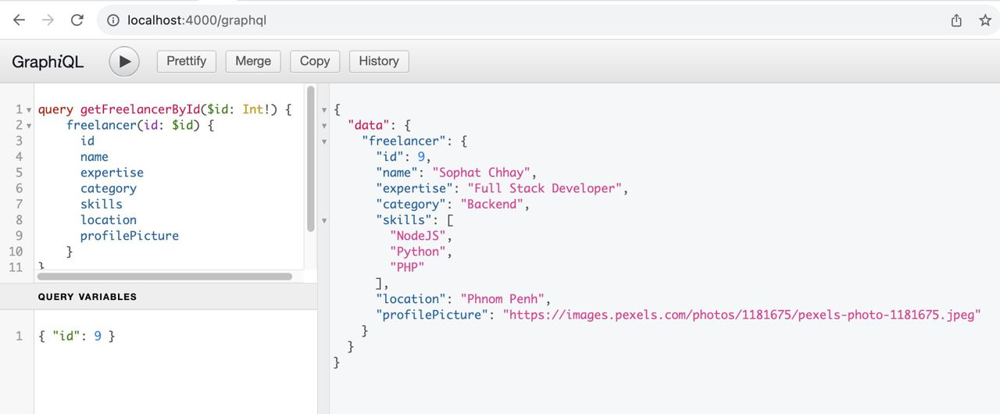
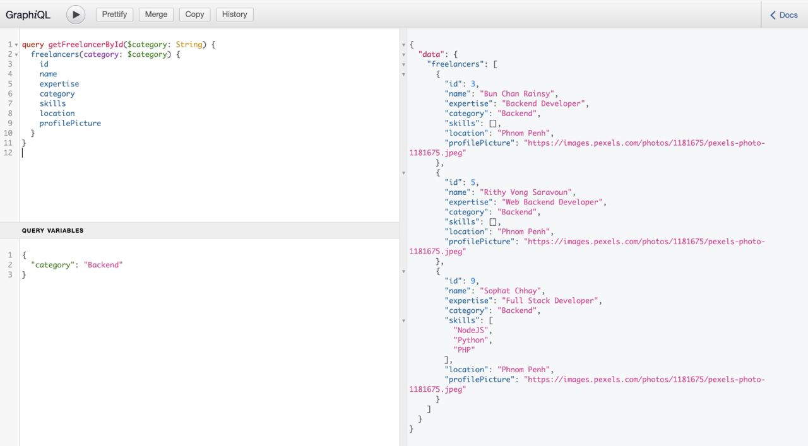

# freelancer-express-graphql
The simplest way to run a GraphQL API server is to use Express, a popular web application framework for Node.js. This example show you how to query freelancer profile with ID and Category from the data source.






## Install

```
$ npm init
```

```
$ npm i graphql express express-graphql -–save
```

## Change Type as Module in file package.json

```
$ "type": "module"
```

## Modify package.json to run command start server
Add `start` inner `scripts` with value `node server.js`

```
$ "start": "node server.js"
```

## Run Server

```
$ npm start

```

## Stay in touch
- Author - [Sophat Chhay](https://sophat.bio)
- Website - [https://expressjs.com](https://expressjs.com/)
